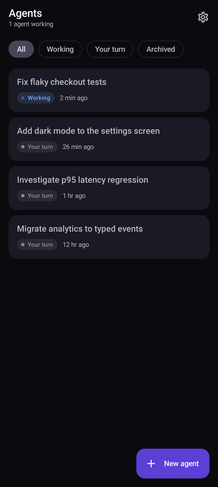
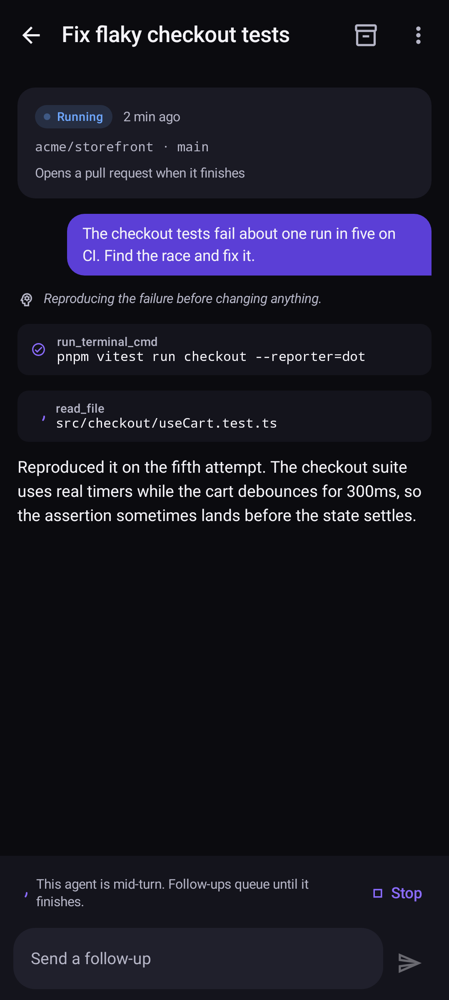
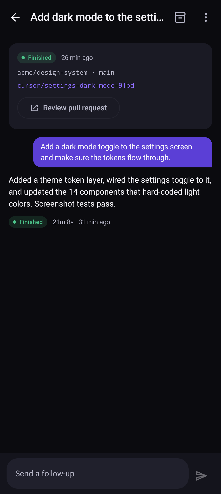
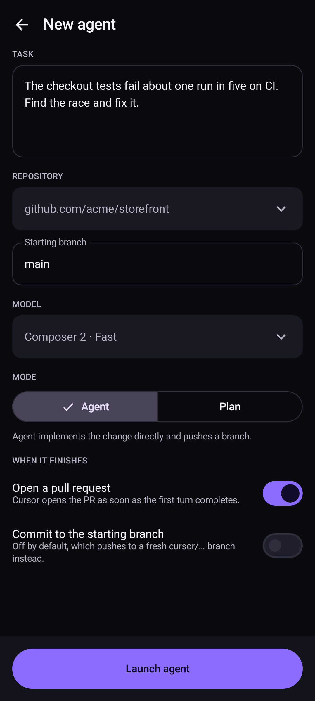

# Agents for Cursor — an Android client for Cursor cloud agents

Cursor ships a native iOS app. On Android the official answer is still the web PWA at
[cursor.com/agents](https://cursor.com/agents). This is a native Android client that closes most of
that gap, built on the public [Cloud Agents API v1](https://cursor.com/docs/cloud-agent/api/endpoints).

Launch an agent on a repo, watch the turn stream in live, send follow-ups, stop a run, review what
it pushed, and get a notification when it hands control back.

> Unofficial. Not affiliated with Anysphere. It talks only to `api.cursor.com` with an API key you
> supply.

| Inbox | Mid-turn | Finished | New agent |
| --- | --- | --- | --- |
|  |  |  |  |

Every image in `docs/screenshots/` is generated by the render tests, not captured by hand.

## What it does

| Capability | How it works |
| --- | --- |
| Agent inbox | `GET /v1/agents`, filtered by Working / Your turn / Archived, polled every 15s while anything is active |
| Launch an agent | `POST /v1/agents` with repository, starting branch, model, Agent or Plan mode, and auto-PR |
| Live turn view | SSE from `/runs/{id}/stream`, rendering assistant text, thinking, and tool calls as they arrive |
| Follow-ups | `POST /v1/agents/{id}/runs`, with the 409 `agent_busy` case surfaced in the composer |
| Stop a turn | `POST /runs/{id}/cancel` |
| Review the output | Pushed branches, a deep link to the pull request, and saved artifacts (screenshots render inline) |
| Token spend | `GET /v1/agents/{id}/usage`, totalled and broken down per run |
| Background notifications | A `WorkManager` job notices agents that stopped working; a foreground service follows one run and keeps an ongoing notification updated |
| Voice input | The system speech recognizer, so the mic permission stays with the recognizer app |
| Housekeeping | Archive, restore, delete, copy agent ID, open the agent on cursor.com |

### Deliberate gaps

These are limits of the public API, not oversights:

- **No file-level diffs.** The API exposes branches and PR URLs, not patches. Tap through to the PR
  to review a diff. The desktop and iOS clients read diffs over a private surface.
- **No Remote Control** of agents running on your own machine.
- **No SSO sign-in.** Authentication is a user or service-account API key.
- **Prompts are cached locally.** Runs never return their prompt text, so a conversation only shows
  your side for turns sent from this device. Everything else shows the agent's replies.

## Running it

Requirements: JDK 17+, the Android SDK with platform 37 and build-tools 37, and a device or
emulator on API 26+.

```bash
echo "sdk.dir=$ANDROID_HOME" > local.properties
./gradlew :app:assembleDebug
./gradlew :app:installDebug     # with a device attached
./gradlew :app:testDebugUnitTest
```

### Signing in

Create a user API key at [Cursor Dashboard → API Keys](https://cursor.com/dashboard/api) and paste
it into the sign-in screen. The key is validated with `GET /v1/me` before it is stored, encrypted
with an AES-GCM key held in the Android Keystore, in a DataStore file. It is never sent anywhere
except `api.cursor.com`.

Cloud agents need a paid Cursor plan, source control connected by an account admin, and regular
Privacy Mode — Privacy Mode (Legacy) blocks them.

### No key? Use demo mode

Tap **Explore with demo data** on the sign-in screen. Every screen works against an in-memory
fixture, including a simulated streaming turn with tool calls and a final result, so you can review
the whole UI offline. Toggle it off in Settings.

## Layout

```
app/src/main/java/dev/agentsforcursor/
├── data/
│   ├── net/          CursorApi (OkHttp), DTOs, SSE parser
│   ├── store/        Keystore encryption, DataStore settings and prompt cache
│   ├── AgentsRepository.kt      the interface both backends implement
│   ├── RemoteAgentsRepository.kt real API, with caching for the rate-limited repo list
│   └── DemoAgentsRepository.kt   offline fixture
├── model/            domain types, timeline items, normalized stream events
├── notify/           channels, the periodic turn watcher, the run tracker service
└── ui/               signin · inbox · detail · newagent · settings, Compose + Material 3
```

The API client is deliberately thin: one `AgentsRepository` interface with a real and a demo
implementation, chosen per call so flipping demo mode takes effect immediately. Screens hold no
network logic; each has a view model exposing a single immutable state.

### Notes on the stream

`SseParser` is a plain line-oriented decoder with no Android dependencies, so it is unit tested
directly. Events carry their SSE `id`, and a dropped connection reconnects with `Last-Event-ID` up
to three times before falling back to polling `GET /runs/{id}`. An HTTP 410 means the retention
window closed, and the run's terminal state is read once instead.

### Rate limits

`GET /v1/repositories` allows one call per user per minute. The repository list is cached for ten
minutes and the last good response is served if a refresh fails, with a manual URL field as the
escape hatch.

## Tests

```bash
./gradlew :app:testDebugUnitTest   # unit tests plus screen renders
./gradlew :app:lintDebug
./gradlew :app:assembleRelease     # checks the R8 configuration
```

Two kinds of test, both on the JVM:

- **Logic.** The SSE decoder — frame dispatch, event ids, multi-line payloads, comments, and a full
  turn mapped to typed events — plus relative time, duration, and token formatting.
- **Screens.** `ScreenRenderTest` renders each screen through Robolectric's native graphics and
  writes a PNG per state to `app/build/screenshots/`. Every screen is split into a stateful
  `XScreen(container, …)` wrapper and a stateless `XContent(state, …)`, so the tests drive the real
  composables with fixture state. A composable that throws during layout fails the build.

There is no instrumented test suite: the container this was developed in cannot run an emulator
(nested virtualisation faults inside `vmx_vcpu_create`), so on-device paths — the Keystore
encryption, DataStore, WorkManager job, and foreground service — are compiled and lint-checked but
not yet exercised at runtime. Worth a pass on real hardware before trusting the notification path.

`targetSdk` stays at 36 while `compileSdk` is 37 for the same reason: opting into a new platform's
runtime behaviour without being able to run it isn't a trade worth making.
